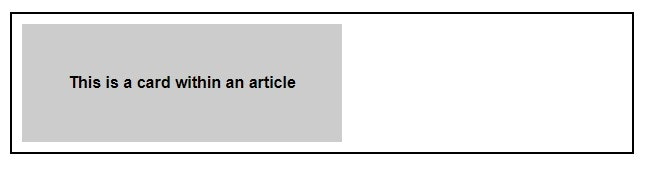

### Container queries

CSS Container Queries are all the buzz! Let's take a quick look at this feature that allows developers to create responsive designs based on the dimensions of the container rather than the viewport. While you may still use a responsive grid for overall page layout, a component within that grid can define its own changes in behavior by querying its container.

To start using CSS Container Queries, you may have to enable experimental features in your browser. In Google Chrome, you can do this by going to [chrome://flags](chrome://flags) in the address bar and enabling the "CSS Container Queries" feature. However, container queries are already supported in most recent versions of stable browsers as of early 2023.

The CSS at-rule @container is where it all begins. The *container-condition* value is used to specify a set of features that are evaluated against the query container when its size changes. Here's a quick example:

```css
/* Set the container context as inline-size */
article {
	container-type: inline-size;
}

/* Apply styles if the container is narrower than 768px */
@container (width < 768px) {
	.card {
		background-color: #ccc;
		font-size: 1em;
		width: 50%;
	}
}
```


In the above example, whenever an article element is narrower than 768px, an element with the .card class inside it will have the designated styles applied, as shown below.



There are several other variables and descriptors that can be used within the container condition, such as *aspect-ratio*, *block-size*, *height*, *width*, etc. so be sure to dig deeper into this exciting CSS feature to see all the various ways it can be used.

You can see how container queries open up a world of possibilities for us. Although, as of this writing, the spec is still in progress, meaning it could change at any time, the potential is exciting! We're looking forward to where responsive design is heading with this next step - how about you?
